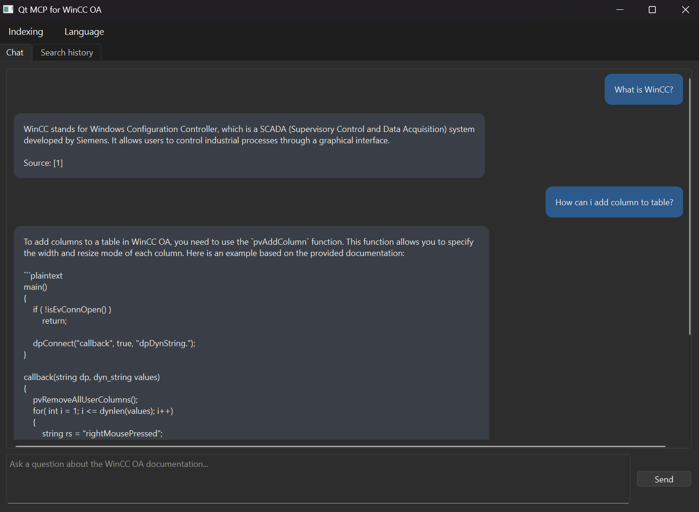
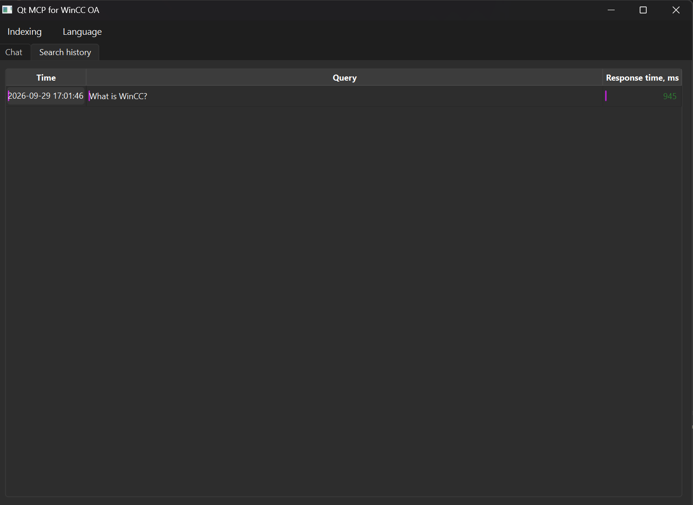
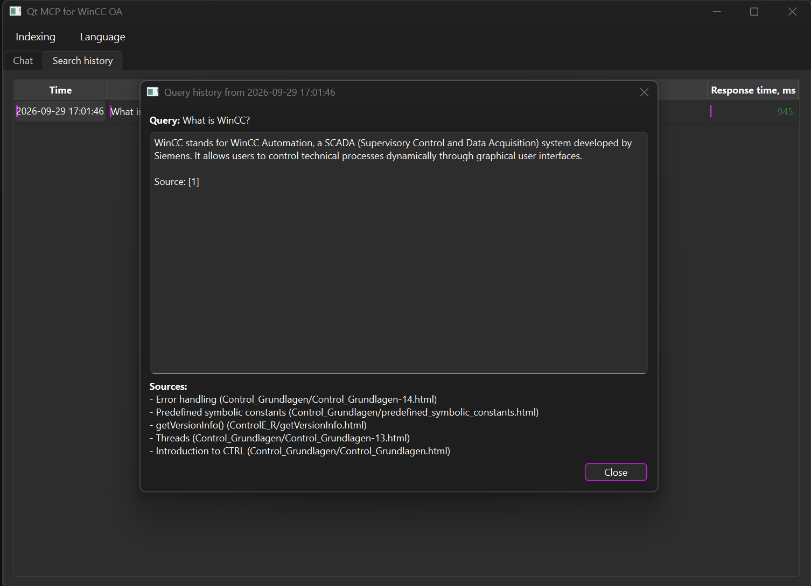

# qt-mcp-for-wincc — a C++/Qt MCP server with RAG over the WinCC OA documentation

A RAG system over the WinCC OA documentation (`en_US/`) built in C++20/Qt6,
with an explicit architecture (SOLID, MVC, DI through interfaces) and its own
GUI chat in the spirit of Claude Code. Started as a second, independent
implementation alongside an earlier Python prototype of the same idea.

**Not meant to be connected to Claude Code/Desktop.** The only model in the
whole system is local (LM Studio, OpenAI-compatible API). Internally there's
an HTTP/JSON-RPC server following an MCP-like scheme
(`initialize`/`tools/list`/`tools/call`), but it's a learning demonstration
of the "transport kept separate from business logic" pattern — the only
real client of this engine is the built-in Qt GUI.

## Screenshots

**Chat** — asking a question, getting an answer generated from the retrieved documentation:



**Search history** — every question is logged with a timestamp and response time:



**History detail** — double-clicking a row shows the full question, answer and sources:



## Architecture

```
core/            interfaces + models + business services (RagService, IngestionService,
                 McpToolRegistry) - almost no Qt (only QJsonValue as a value-type)
infrastructure/  adapters: LM Studio (llm/), lexbor (parsing/), SQLite+sqlite-vec
                 (persistence/), HTTP/JSON-RPC (mcp/)
app/             Qt Widgets GUI, MVC: chat/ (chat) and history/ (search history)
app_main/        composition root (main.cpp) - the only place that sees both
                 core::interfaces and the concrete infrastructure classes
tests/           GoogleTest: core/, infrastructure/, app/ (QAbstractItemModelTester)
third_party/     CMake wrapper around sqlite-vec, vendored via FetchContent
```

For the reasoning behind the architecture (which pattern where and why), in
short: SRP/OCP/LSP/ISP/DIP are upheld through the interfaces in
`core/interfaces`; MVC lives in `app/chat` and `app/history` (View = `*View`,
Model = `QAbstractItemModel` subclasses, Controller = `*Controller`);
Command is `JsonRpcDispatcher`/`McpToolRegistry`; Adapter is
`LmStudioClient`/`HttpJsonRpcTransport`; Repository is
`SqliteDocumentRepository`/`SqliteChatHistoryRepository`/`SqliteVectorStore`.

## Tech stack

**C++20 features** — used deliberately, not just "targeting the standard":

| Feature | Where |
|---|---|
| `std::jthread` + `std::stop_token` | [HttpJsonRpcTransport.h](infrastructure/mcp/HttpJsonRpcTransport.h) — cooperative shutdown of the background HTTP server thread |
| Structured bindings | [IngestionService.cpp](core/services/IngestionService.cpp), [SqliteDocumentRepository.cpp](infrastructure/persistence/SqliteDocumentRepository.cpp) — `const auto [id, changed] = ...` |
| Trailing return type on lambdas | [ChatController.cpp](app/chat/ChatController.cpp), [MainWindow.cpp](app/mainwindow/MainWindow.cpp) — `QtConcurrent::run([...]() -> RagAnswer { ... })` |
| `std::optional` | [IDocumentRepository.h](core/interfaces/IDocumentRepository.h), [IHtmlDocumentParser.h](core/interfaces/IHtmlDocumentParser.h) |
| RAII wrappers | [SqliteConnection.h/.cpp](infrastructure/persistence/SqliteConnection.h), [SqliteStatement.h/.cpp](infrastructure/persistence/SqliteStatement.h) — no manual `sqlite3_close`/`sqlite3_finalize` at call sites |
| Move semantics | [LmStudioClient.cpp](infrastructure/llm/LmStudioClient.cpp), [HttpJsonRpcTransport.cpp](infrastructure/mcp/HttpJsonRpcTransport.cpp) |
| `constexpr` | [ChatMessageDelegate.h](app/chat/ChatMessageDelegate.h), [JsonRpc.h](core/models/JsonRpc.h) (`JsonRpcErrorCode` constants) |
| Namespace aliases | [JsonRpcDispatcher.cpp](infrastructure/mcp/JsonRpcDispatcher.cpp) — aliasing a `namespace` that a `using`-declaration can't reach |
| `std::unordered_map<std::string, std::function<...>>` (Command pattern) | [McpToolRegistry.h](core/services/McpToolRegistry.h), [JsonRpcDispatcher.h](infrastructure/mcp/JsonRpcDispatcher.h) |

**Qt6 modules**:

| Module | Where / what |
|---|---|
| **QtCore** | meta-object system (`Q_OBJECT`, signals/slots) throughout `app/`; `QJsonValue`/`QJsonObject`/`QJsonDocument` as the JSON-RPC wire format in [JsonRpc.h](core/models/JsonRpc.h) and [infrastructure/mcp/](infrastructure/mcp); `QTranslator`-based i18n in [TranslationManager.h/.cpp](app/common/TranslationManager.h) |
| **QtWidgets** | `QMainWindow`/`QTabWidget`/`QMenu` in [MainWindow.cpp](app/mainwindow/MainWindow.cpp); `QAbstractListModel` in [ChatMessageListModel.h/.cpp](app/chat/ChatMessageListModel.h); `QAbstractTableModel` in [SearchHistoryTableModel.h/.cpp](app/history/SearchHistoryTableModel.h); custom `QStyledItemDelegate` paint/sizeHint in [ChatMessageDelegate.cpp](app/chat/ChatMessageDelegate.cpp) (chat bubbles via `QTextDocument`) and [HistoryTableItemDelegate.cpp](app/history/HistoryTableItemDelegate.cpp); `QDialog` in [ChatHistoryDialog.h/.cpp](app/history/ChatHistoryDialog.h) |
| **QtConcurrent** | `QtConcurrent::run` + `QFutureWatcher` in [ChatController.cpp](app/chat/ChatController.cpp) and [MainWindow.cpp](app/mainwindow/MainWindow.cpp) — background work without a hand-rolled `QThread` |
| **QtTest** | `QAbstractItemModelTester` in [SearchHistoryTableModelTest.cpp](tests/app/SearchHistoryTableModelTest.cpp) — validates the custom table model against Qt's own model/view contract |

**Third-party (via CMake `FetchContent`, see [Dependencies](#dependencies) below)**: [lexbor](infrastructure/parsing/LexborHtmlParser.cpp) (HTML5 parsing + CSS selectors), [cpp-httplib](infrastructure/llm/LmStudioClient.cpp) (HTTP client *and* server — [also here](infrastructure/mcp/HttpJsonRpcTransport.cpp)), [sqlite3 + sqlite-vec](infrastructure/persistence) (vector search), [GoogleTest](tests).

## Dependencies

Managed by CMake `FetchContent` (**no Conan** — see [cmake/Dependencies.cmake](cmake/Dependencies.cmake)):
`sqlite3` (amalgamation), `sqlite-vec`, `lexbor` (HTML5 + CSS selectors,
analogous to `BeautifulSoup.select_one`), `cpp-httplib` (HTTP client and
server, one library instead of two), `googletest`. The first configuration
downloads the sources (needs internet); after that everything is cached in
`build/_deps`.

**Qt6 needs to be installed separately** — building it from source via
FetchContent isn't practical (hours of build time). Options:
- [Qt Online Installer](https://www.qt.io/download-qt-installer) (components: Qt 6.x, plus MSVC 2022 64-bit or the bundled MinGW kit)
- `pip install aqtinstall && aqt install-qt windows desktop 6.7.2 win64_msvc2019_64`

## Building (Windows)

Two toolchains are supported out of the box: MSVC or the MinGW bundled with
the Qt installer.

0. Download `en_US.zip` from this repo's [Releases](../../releases) page and
   extract it so you end up with an `en_US/` folder at the project root
   (next to `CMakeLists.txt`). The WinCC OA documentation (~140 MB) isn't
   tracked in git — it ships as a release asset instead.
1. Copy `CMakeUserPresets.json.example` → `CMakeUserPresets.json` and point
   `CMAKE_PREFIX_PATH` (and, for MinGW, `CMAKE_C_COMPILER`/`CMAKE_CXX_COMPILER`)
   at your Qt6 installation.
2. **MSVC**: open an **x64 Native Tools Command Prompt for VS** (otherwise
   `cl.exe` won't be found) and run:

   ```bash
   cmake --preset my-windows
   cmake --build --preset my-windows
   ```

   **MinGW**: run in any terminal:

   ```bash
   cmake --preset my-mingw
   cmake --build --preset my-mingw
   ```

3. Tests: `ctest --preset my-windows` (or `my-mingw`, or `--test-dir build/<preset>`).

If the built `.exe` fails to start with a missing-DLL error, add Qt's and
(for MinGW) the compiler's `bin` directories to `PATH` before running it —
see the `environment` block in the `my-mingw` preset for an example.

## Configuring LM Studio

Same as the Python version: LM Studio running, Local Server enabled, a chat
model and an embedding model loaded. Settings are read from environment
variables (the same names as in the Python version's `.env`):

```
LLM_BASE_URL=http://127.0.0.1:1234
LLM_CHAT_MODEL=<chat model name>
LLM_EMBED_MODEL=<embedding model name>
LLM_API_KEY=lm-studio
```

Plus settings specific to the C++ version:

```
WINCCMCP_DOCS_DIR=<path to en_US>          # defaults to ./en_US
WINCCMCP_DB_PATH=<path to .sqlite3>        # defaults to data/winccoa_docs.sqlite3
WINCCMCP_HTTP_HOST=127.0.0.1               # the internal HTTP/JSON-RPC server
WINCCMCP_HTTP_PORT=8765
```

## Running

```bash
build\my-windows\app_main\qt-mcp-for-wincc.exe
```

On startup the app connects to LM Studio to learn the embedding dimension
(needed for the SQLite schema) — if LM Studio doesn't respond, an error
dialog is shown instead of a crash. The index is built manually: menu
**Indexing → Build index...** (progress per file; safe to re-run — pages
that haven't changed are skipped by content hash). After that you can ask
questions in the **Chat** tab; every query lands in the **Search history**
tab (double-click a row for the full question/answer/sources text).

The **Language** menu switches the interface between English and Russian at
runtime, no restart needed (`QTranslator`, `.ts`/`.qm` in [i18n/](i18n)).

## Known simplifications

- The HTTP/JSON-RPC server is a stateless variant of the MCP Streamable HTTP
  transport (one request → one response, no SSE or sessions) and hasn't been
  tested against real external MCP clients — that's not the goal of this project.
- `i18n/winccmcp_ru.ts` covers the main visible strings; when new `tr()` calls
  are added to the code, the Russian translation needs to be updated by hand
  (no `lupdate` auto-generation wired into the current build).
- Builds and runs successfully with both MSVC and MinGW on Windows, and has
  been exercised manually end-to-end (indexing the full documentation set and
  chatting against it through LM Studio) — but it hasn't been run through a
  CI pipeline, so a fresh clone/build on a different machine may still need
  minor adjustments (Qt path, compiler path, LM Studio model names).
